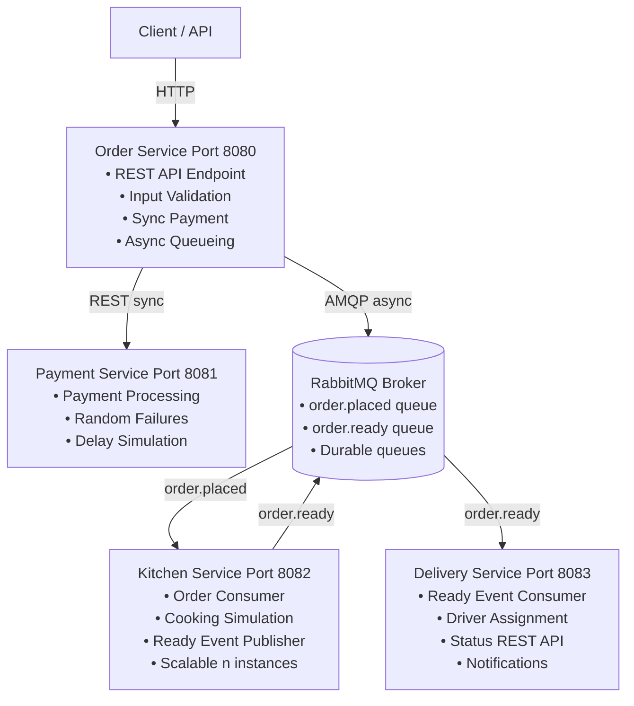
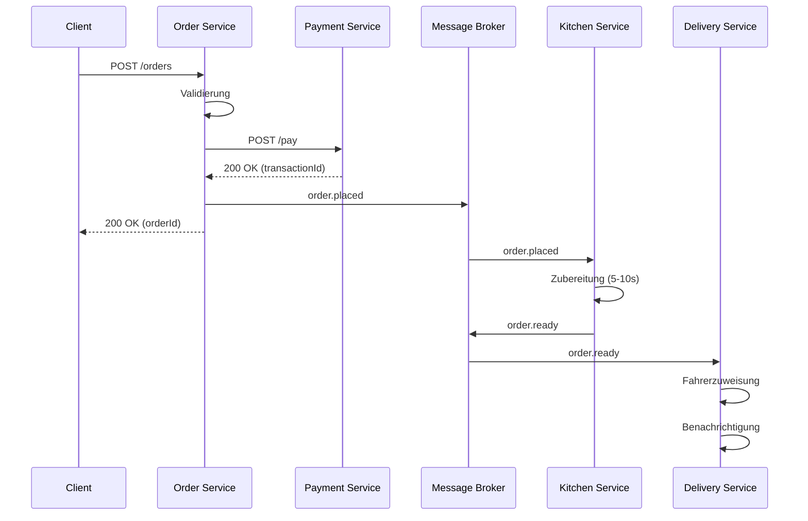
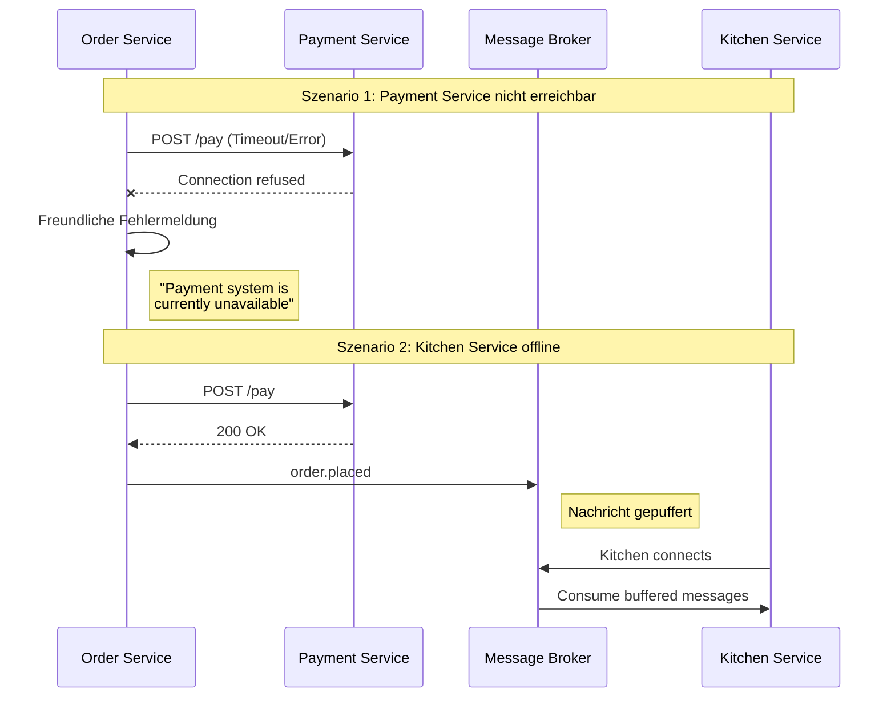

# Architektur-Dokumentation: Distributed Pizza Platform

## Übersicht

Die Distributed Pizza Platform ist eine Microservices-Architektur, die einen kompletten Pizza-Lieferdienst demonstriert. Das System verwendet moderne Patterns wie asynchrone Kommunikation, Event-Driven Architecture und Competing Consumers.

## System-Architektur

### Komponenten-Übersicht



## Kommunikations-Patterns

### Bestellablauf



### 1. Synchrone Kommunikation (REST)

**Order Service → Payment Service**

```
POST /pay
Content-Type: application/json

{
  "orderId": "uuid",
  "customerName": "Max Mustermann",
  "amount": 31.98
}

Response:
{
  "transactionId": "uuid",
  "success": true/false,
  "message": "Payment processed successfully"
}
```

**Eigenschaften:**
- Timeout: 5 Sekunden
- Error Handling: Circuit Breaker Pattern (Basis)
- Resilience: Graceful Degradation bei Service-Ausfall

### 2. Asynchrone Kommunikation (RabbitMQ)

**Order Service → Kitchen Service (order.placed Queue)**

```json
{
  "orderId": "123e4567-e89b-12d3-a456-426614174000",
  "pizza": "Margherita",
  "quantity": 2,
  "address": "Musterstrasse 123, 8000 Zürich",
  "customerName": "Max Mustermann",
  "timestamp": "2026-01-09T10:30:00"
}
```

**Kitchen Service → Delivery Service (order.ready Queue)**

```json
{
  "orderId": "123e4567-e89b-12d3-a456-426614174000",
  "pizza": "Margherita",
  "quantity": 2,
  "address": "Musterstrasse 123, 8000 Zürich",
  "customerName": "Max Mustermann",
  "preparedAt": "2026-01-09T10:35:00"
}
```

**Eigenschaften:**
- Durable Queues: Nachrichten überleben Broker-Neustart
- At-Least-Once Delivery: Garantierte Nachrichtenzustellung
- Competing Consumers: Lastverteilung über mehrere Instanzen

## Design Patterns

### 1. Contract-First Design
- Alle Schnittstellen sind vor der Implementierung definiert
- JSON-Schemas für alle API-Endpunkte
- Message-Schemas für alle Events

### 2. Loose Coupling
- Services kennen sich nicht direkt
- Kommunikation über Message Broker
- Keine direkten Abhängigkeiten zwischen Services

### 3. Event-Driven Architecture
- Events statt direkte Aufrufe
- Publish-Subscribe Pattern
- Asynchrone Verarbeitung

### 4. Competing Consumers
- Mehrere Kitchen Service Instanzen
- Automatische Lastverteilung durch RabbitMQ
- Horizontale Skalierbarkeit

### 5. Circuit Breaker (Basis)
- Timeout-Handling bei REST-Calls
- Fehlerbehandlung ohne Crash
- Graceful Degradation

## Resilience & Hochverfügbarkeit



### Verfügbarkeitsmerkmale

- **Durable Queues:** RabbitMQ Persistence verhindert Datenverluste
- **Async Processing:** Message Broker entkoppelt Services
- **Retry Logic:** Spring AMQP mit automatischen Wiederholungen
- **Timeout Handling:** RestTemplate Config verhindert hängende Requests
- **Horizontal Scaling:** Stateless Services ermöglichen beliebige Skalierung

## Technologie-Stack

### Backend-Framework
- **Java 21**: Moderne Java-Version mit Virtual Threads Support
- **Spring Boot 3.2.1**: Enterprise-Framework
- **Spring AMQP**: RabbitMQ Integration
- **Spring Web**: REST API Support
- **Spring Validation**: Input Validation

### Message Broker
- **RabbitMQ 3.12**: AMQP Message Broker
- **Management UI**: Monitoring und Administration
- **Durable Queues**: Persistente Nachrichtenspeicherung

### Build & Deployment
- **Maven 3.9+**: Build-Tool
- **Docker**: Containerisierung
- **Docker Compose**: Multi-Container Orchestrierung

## Deployment-Architektur

### Docker Compose Setup

```yaml
services:
  - rabbitmq:       Port 5672 (AMQP), 15672 (Management UI)
  - order-service:  Port 8080
  - payment-service: Port 8081
  - kitchen-service: Port 8082 (skalierbar)
  - delivery-service: Port 8083

networks:
  - pizza-network (bridge)
```

### Skalierung

```bash
# Standard: 1 Kitchen Instance
docker-compose up

# Skaliert: 3 Kitchen Instances
docker-compose up --scale kitchen-service=3
```

## Monitoring & Observability

### Health Endpoints

Alle Services bieten Health-Checks:
- `GET /orders/health` (Order Service)
- `GET /health` (Payment Service)
- `GET /deliveries/health` (Delivery Service)

### RabbitMQ Management UI

Zugriff: http://localhost:15672
- Username: guest
- Password: guest

**Features:**
- Queue Monitoring
- Message Rates
- Consumer Status
- Memory Usage

### Logging

**Strukturiertes Logging mit SLF4J:**
- INFO Level: Normale Operations
- DEBUG Level: RabbitMQ-Details
- ERROR Level: Fehler und Exceptions

**Log-Ausgaben enthalten:**
- Order IDs für Tracing
- Instance IDs (Kitchen Service)
- Timestamps
- Service Names

## Performance-Charakteristiken

**Latency:**
- Order REST API: 50-100ms (max 500ms)
- Payment Processing: 100-500ms (max 2s mit Simulation)
- Kitchen Processing: 5-10s (Simulation)
- Message Delivery: <50ms (max 100ms)

**Throughput:**
- Order/Payment Service: ~100 req/s
- Kitchen Service: ~0.1-0.2 orders/s (1 Instanz), ~0.3-0.6 orders/s (3 Instanzen)
- Message Broker: >1000 msg/s

**Skalierbarkeit:**
- Order/Payment Service: Horizontal skalierbar (Load Balancer erforderlich)
- Kitchen/Delivery Service: Horizontal skalierbar (automatisch durch RabbitMQ)

## Security Considerations

**Aktuelle Implementierung:**
- Input Validation mit Bean Validation
- Error Handling ohne Stacktraces im Response
- Konfigurierte Timeouts für REST-Calls

**Empfohlene Erweiterungen:**
- Authentication & Authorization (OAuth 2.0, JWT)
- Transport Security (TLS für alle Verbindungen)
- Rate Limiting (API Gateway)
- Secrets Management (Vault, AWS Secrets Manager)

## Erweiterungsmöglichkeiten

**Kurzfristig:**
- Persistence Layer (PostgreSQL, Redis Cache)
- API Gateway (Kong, Spring Cloud Gateway)
- Service Discovery (Consul, Eureka)

**Mittelfristig:**
- Observability (Prometheus, Grafana, Jaeger, ELK Stack)
- Advanced Messaging (Topic Exchange, Dead Letter Queues)
- Configuration Management (Spring Cloud Config Server)

**Langfristig:**
- Saga Pattern (Compensating Transactions, Event Sourcing)
- CQRS (Separate Read/Write Models)
- Kubernetes (Auto-Scaling, Self-Healing)

## Testing-Strategie

- **Unit Tests:** JUnit 5, Mockito (Coverage > 80%)
- **Integration Tests:** @SpringBootTest, @WebMvcTest, @DataJpaTest, Testcontainers
- **Contract Tests:** Pact für Consumer-Driven Contracts
- **End-to-End Tests:** Docker Compose, Postman/Newman

## Betrieb & Operations

**Deployment:**
```bash
./build-all.sh && ./test-system.sh && docker compose up --build
docker compose up --scale kitchen-service=N
```

**Monitoring Checklist:**
- Alle Services healthy
- RabbitMQ Queues nicht überlaufen
- Keine Error Logs (letzte 5 Min)
- Response Times < 500ms (p95)
- CPU/Memory Usage < 80%

## Zusammenfassung

Die Distributed Pizza Platform demonstriert eine moderne Microservices-Architektur mit:

✅ **Loose Coupling** durch Message Broker
✅ **High Availability** durch Pufferung und Retry-Logic
✅ **Scalability** durch Competing Consumers
✅ **Resilience** durch Timeout-Handling und Graceful Degradation
✅ **Observability** durch Structured Logging und Health Endpoints
✅ **Maintainability** durch klare Service-Grenzen und Contracts

Das System ist production-ready mit bekannten Erweiterungsmöglichkeiten und bietet eine solide Basis für einen echten Pizza-Lieferdienst.
