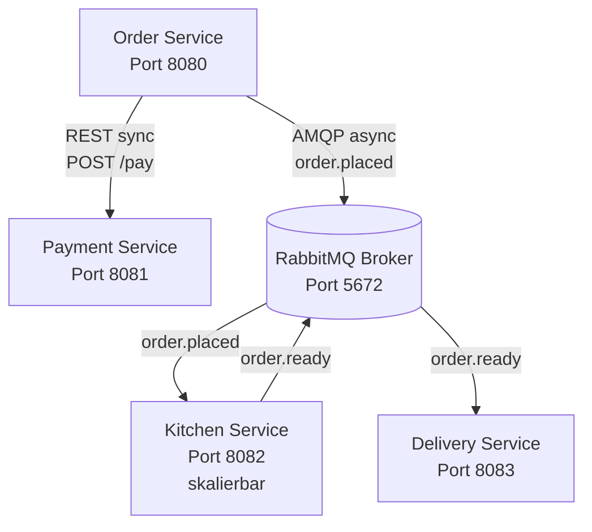

# Distributed Pizza Platform - Microservices Architecture

## Projektübersicht

Dieses Projekt implementiert eine verteilte Plattform für einen Pizza-Lieferdienst mit vier unabhängigen Microservices, die über REST und RabbitMQ kommunizieren. Das System demonstriert moderne Microservice-Patterns wie asynchrone Kommunikation, Resilience und horizontale Skalierung.

## Architektur



## Services

### 1. Order Service (Port 8080)
**Rolle:** Einstiegspunkt für Kundenbestellungen

**Verantwortlichkeiten:**
- Bereitstellung der REST API `POST /orders`
- Validierung der Eingabedaten (Pizza, Adresse, Kundendaten)
- Synchrone Kommunikation mit Payment Service
- Asynchrone Weiterleitung an Kitchen Service via RabbitMQ
- Fehlerbehandlung und Resilience

**Endpoints:**
- `POST /orders` - Neue Bestellung aufgeben
- `GET /orders/health` - Health Check

**Technologie:** Java 21, Spring Boot, Spring AMQP

### 2. Payment Service (Port 8081)
**Rolle:** Zahlungsabwicklung

**Verantwortlichkeiten:**
- Bereitstellung der REST API `POST /pay`
- Simulation der Zahlungsverarbeitung mit Verzögerungen
- Zufällige Fehler zur Resilience-Testing (20% Fehlerrate)

**Endpoints:**
- `POST /pay` - Zahlung verarbeiten
- `GET /health` - Health Check

**Technologie:** Java 21, Spring Boot

### 3. Kitchen Service (Port 8082)
**Rolle:** Asynchrone Verarbeitung von Bestellungen

**Verantwortlichkeiten:**
- Konsumiert `order.placed` Events aus RabbitMQ
- Simuliert Zubereitungszeit (5-10 Sekunden)
- Veröffentlicht `order.ready` Events nach Fertigstellung
- Unterstützt Competing Consumers Pattern (horizontal skalierbar)

**Technologie:** Java 21, Spring Boot, Spring AMQP, RabbitMQ Listener

### 4. Delivery & Notification Service (Port 8083)
**Rolle:** Lieferverwaltung und Benachrichtigungen

**Verantwortlichkeiten:**
- Konsumiert `order.ready` Events aus RabbitMQ
- Simuliert Fahrerzuweisung
- Sendet Kundenbenachrichtigungen (simuliert via Logs)
- Bereitstellung der REST API für Statusabfragen

**Endpoints:**
- `GET /deliveries/{orderId}` - Status einer Lieferung abrufen
- `GET /deliveries` - Alle Lieferungen anzeigen
- `GET /deliveries/health` - Health Check

**Technologie:** Java 21, Spring Boot, Spring AMQP

### 5. Frontend (Port 3000)
**Rolle:** Web-Benutzeroberfläche für Live-Visualisierung

**Verantwortlichkeiten:**
- Benutzerfreundliches Interface für Bestellungen
- Echtzeit-Anzeige von Bestellstatus
- Übersicht über aktive Lieferungen
- Live-Statistiken Dashboard

**Endpoints:**
- `GET /` - Web Interface
- `GET /health` - Health Check

**Technologie:** Node.js 18, Express.js, Vanilla JavaScript

## Voraussetzungen

- **Java 21** (JDK)
- **Maven 3.8+**
- **Node.js 18+** (für Frontend)
- **Docker & Docker Compose**

## Installation und Start

### Option 1: Mit Docker Compose (empfohlen)

Der einfachste Weg ist die Nutzung von Docker Compose, welches alle Services inklusive Frontend automatisch baut und startet.

1. **Alle Services auf einmal starten:**
```bash
docker compose up --build
```

2. **Frontend aufrufen:**
Öffnen Sie http://localhost:3000 im Browser

3. **Mehrere Kitchen Service Instanzen starten (für Skalierungstests):**
```bash
docker compose up --build --scale kitchen-service=3
```

### Option 2: Services einzeln bauen (für Entwicklung)

1. **Backend Services bauen:**
```bash
# In jedem Service-Verzeichnis
cd order-service
mvn clean package
cd ../payment-service
mvn clean package
cd ../kitchen-service
mvn clean package
cd ../delivery-service
mvn clean package
cd ..
```

2. **Frontend bauen:**
```bash
cd frontend
npm install
cd ..
```

3. **Docker Compose starten:**
```bash
docker compose up --build
```

### Option 3: Lokal ohne Docker

1. **RabbitMQ lokal starten:**
```bash
docker run -d --name rabbitmq -p 5672:5672 -p 15672:15672 rabbitmq:3.12-management-alpine
```

2. **Services einzeln starten:**

Terminal 1:
```bash
cd payment-service
mvn spring-boot:run
```

Terminal 2:
```bash
cd order-service
mvn spring-boot:run
```

Terminal 3:
```bash
cd kitchen-service
mvn spring-boot:run
```

Terminal 4:
```bash
cd delivery-service
mvn spring-boot:run
```

Terminal 5 (Frontend):
```bash
cd frontend
npm start
```

## Zugriff auf die Dienste

Nach dem Start sind folgende Dienste verfügbar:

- **Frontend:** http://localhost:3000 - Web-Interface für Bestellungen
- **Order Service:** http://localhost:8080 - REST API
- **Payment Service:** http://localhost:8081 - REST API
- **Kitchen Service:** http://localhost:8082 - Asynchron via RabbitMQ
- **Delivery Service:** http://localhost:8083 - REST API
- **RabbitMQ Management:** http://localhost:15672 - Admin UI (guest/guest)

## API Contracts

### Order Request (POST /orders)
```json
{
  "pizza": "Margherita",
  "quantity": 2,
  "address": "Musterstrasse 123, 8000 Zürich",
  "customerName": "Max Mustermann"
}
```

### Order Response
```json
{
  "orderId": "123e4567-e89b-12d3-a456-426614174000",
  "status": "SUCCESS",
  "message": "Order placed successfully! Your order ID is: 123e4567-e89b-12d3-a456-426614174000"
}
```

### Payment Request (POST /pay)
```json
{
  "orderId": "123e4567-e89b-12d3-a456-426614174000",
  "customerName": "Max Mustermann",
  "amount": 31.98
}
```

### Payment Response
```json
{
  "transactionId": "987fcdeb-51a2-43d7-b543-123456789abc",
  "success": true,
  "message": "Payment processed successfully"
}
```

### RabbitMQ Message: order.placed
```json
{
  "orderId": "123e4567-e89b-12d3-a456-426614174000",
  "pizza": "Margherita",
  "quantity": 2,
  "address": "Musterstrasse 123, 8000 Zürich",
  "customerName": "Max Mustermann",
  "timestamp": "2026-01-09T10:30:00"
}
```

### RabbitMQ Message: order.ready
```json
{
  "orderId": "123e4567-e89b-12d3-a456-426614174000",
  "pizza": "Margherita",
  "quantity": 2,
  "address": "Musterstrasse 123, 8000 Zürich",
  "customerName": "Max Mustermann",
  "preparedAt": "2026-01-09T10:35:00"
}
```

### Delivery Status Response (GET /deliveries/{orderId})
```json
{
  "orderId": "123e4567-e89b-12d3-a456-426614174000",
  "status": "ASSIGNED",
  "driverName": "Anna Schmidt",
  "address": "Musterstrasse 123, 8000 Zürich",
  "assignedAt": "2026-01-09T10:35:00",
  "estimatedDeliveryTime": "2026-01-09T10:55:00"
}
```

## Testing Szenarien

### 0. Mit dem Frontend (empfohlen)

Der einfachste Weg, das System zu testen, ist über das Web-Frontend:

1. **System starten:**
```bash
docker compose up --build
```

2. **Frontend öffnen:**
Öffnen Sie http://localhost:3000 im Browser

3. **Bestellung aufgeben:**
- Füllen Sie das Formular aus (Kundenname, Pizza-Typ, Menge, Adresse)
- Klicken Sie auf "Place Order"
- Beobachten Sie die Bestellung in der "Recent Orders" Liste
- Nach einigen Sekunden erscheint die Lieferung in "Active Deliveries"

4. **Live-Updates beobachten:**
- Das Dashboard aktualisiert sich automatisch alle 3 Sekunden
- Statistiken zeigen die Anzahl der Bestellungen und Lieferungen

### 1. Erfolgreiche Bestellung (via API)
```bash
curl -X POST http://localhost:8080/orders \
  -H "Content-Type: application/json" \
  -d '{
    "pizza": "Margherita",
    "quantity": 2,
    "address": "Musterstrasse 123, 8000 Zürich",
    "customerName": "Max Mustermann"
  }'
```

### 2. Resilience Test: Payment Service offline
```bash
# Payment Service stoppen
docker compose stop payment-service

# Bestellung versuchen - sollte freundliche Fehlermeldung liefern
curl -X POST http://localhost:8080/orders \
  -H "Content-Type: application/json" \
  -d '{
    "pizza": "Margherita",
    "quantity": 1,
    "address": "Teststrasse 1",
    "customerName": "Test User"
  }'

# Payment Service wieder starten
docker compose start payment-service
```

### 3. Pufferung Test: Kitchen Service offline
```bash
# Kitchen Service stoppen
docker compose stop kitchen-service

# 5 Bestellungen absenden (alle sollten akzeptiert werden)
for i in {1..5}; do
  curl -X POST http://localhost:8080/orders \
    -H "Content-Type: application/json" \
    -d "{
      \"pizza\": \"Margherita\",
      \"quantity\": 1,
      \"address\": \"Teststrasse $i\",
      \"customerName\": \"Test User $i\"
    }"
  echo ""
done

# Kitchen Service wieder starten - sollte alle 5 Bestellungen verarbeiten
docker compose start kitchen-service

# Logs prüfen
docker compose logs -f kitchen-service
```

### 4. Skalierung Test: Mehrere Kitchen Instanzen
```bash
# 3 Kitchen Service Instanzen starten
docker compose up --scale kitchen-service=3 -d

# Viele Bestellungen absenden
for i in {1..10}; do
  curl -X POST http://localhost:8080/orders \
    -H "Content-Type: application/json" \
    -d "{
      \"pizza\": \"Margherita\",
      \"quantity\": 1,
      \"address\": \"Teststrasse $i\",
      \"customerName\": \"Test User $i\"
    }"
done

# Logs aller Kitchen Instanzen prüfen - sollten abwechselnd arbeiten
docker compose logs kitchen-service | grep "Received order"
```

### 5. Lieferstatus abfragen
```bash
# Nach erfolgreicher Bestellung mit orderId
curl http://localhost:8083/deliveries/{orderId}

# Alle Lieferungen anzeigen
curl http://localhost:8083/deliveries
```

### 6. Validierung testen
```bash
# Bestellung ohne Pizza
curl -X POST http://localhost:8080/orders \
  -H "Content-Type: application/json" \
  -d '{
    "quantity": 1,
    "address": "Teststrasse 1",
    "customerName": "Test User"
  }'
```

## Hochverfügbarkeit (HA) Features

### 1. Asynchrone Kommunikation
- **Pufferung:** Bestellungen werden in RabbitMQ gespeichert, auch wenn Kitchen Service offline ist
- **Durable Queues:** Nachrichten überleben RabbitMQ-Neustart

### 2. Fehlerbehandlung
- **Graceful Degradation:** Order Service funktioniert weiter, auch wenn Downstream-Services ausfallen
- **Timeout Handling:** Konfigurierbare Timeouts für REST-Calls
- **Circuit Breaker Pattern:** (Basis vorhanden, kann erweitert werden)

### 3. Skalierung
- **Competing Consumers:** Mehrere Kitchen Service Instanzen teilen sich die Arbeit
- **Load Balancing:** RabbitMQ verteilt Nachrichten gleichmäßig

### 4. Monitoring
- **Health Endpoints:** Alle Services bieten `/health` Endpoints
- **Structured Logging:** SLF4J mit aussagekräftigen Log-Nachrichten
- **RabbitMQ Management UI:** http://localhost:15672 (guest/guest)

## Troubleshooting

### RabbitMQ Connection Failed
```bash
# RabbitMQ Status prüfen
docker compose ps rabbitmq

# RabbitMQ Logs prüfen
docker compose logs rabbitmq

# Warten bis RabbitMQ bereit ist
docker compose up -d rabbitmq
sleep 10
docker compose up order-service kitchen-service delivery-service
```

### Service startet nicht
```bash
# Logs eines Services prüfen
docker compose logs order-service

# Service neu bauen
cd order-service
mvn clean package
cd ..
docker compose up --build order-service
```

### Port bereits belegt
```bash
# Verwendete Ports prüfen
lsof -i :8080
lsof -i :8081
lsof -i :8082
lsof -i :8083
lsof -i :5672

# Ports in docker compose.yml anpassen
```

## Erweiterungsmöglichkeiten

1. **Persistence:** Datenbanken für Order History und Delivery Status
2. **Authentication:** OAuth2/JWT für Service-to-Service Kommunikation
3. **Observability:** Integration mit Prometheus, Grafana, Jaeger
4. **API Gateway:** Zentraler Eintrittspunkt mit Kong oder Spring Cloud Gateway
5. **Service Discovery:** Consul oder Eureka für dynamische Service-Registrierung
6. **Configuration Management:** Spring Cloud Config Server
7. **Advanced Messaging:** Topic Exchange statt Direct Queue
8. **Idempotency:** Duplicate Message Detection
9. **Saga Pattern:** Kompensierung bei fehlgeschlagenen Transaktionen
10. **Caching:** Redis für häufig abgefragte Daten

## Projektstruktur

Jeder Service hat seine eigene Verzeichnisstruktur mit:
- `src/main/java/` - Java-Quellcode mit Standard-Layern (controller, service, model, config)
- `src/main/resources/application.yml` - Service-Konfiguration
- `pom.xml` - Maven Dependencies
- `Dockerfile` - Container-Image Definition

## Team & Verantwortlichkeiten

- **Order Service:** Validierung, REST API, Payment Integration, Queue Publishing
- **Payment Service:** Zahlungsverarbeitung, Fehler-Simulation
- **Kitchen Service:** Event Consumption, Zubereitungs-Simulation, Skalierbarkeit
- **Delivery Service:** Event Consumption, Status-API, Benachrichtigungen

## Lizenz

Dieses Projekt wurde für das Modul M321 - Verteilte Systeme erstellt.

## Kontakt

Bei Fragen oder Problemen, bitte ein Issue im Repository erstellen.
